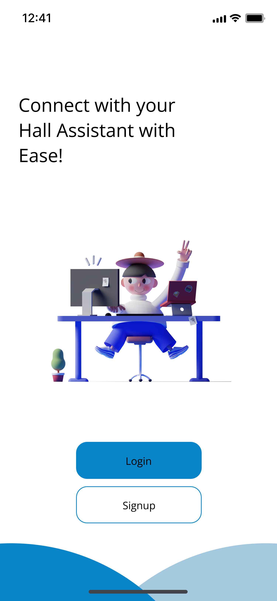
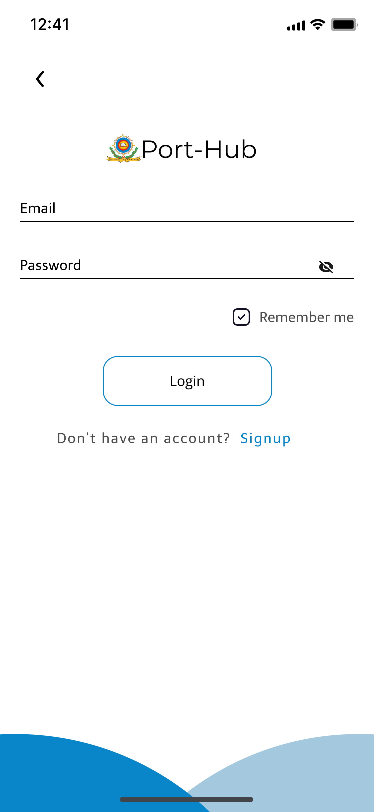
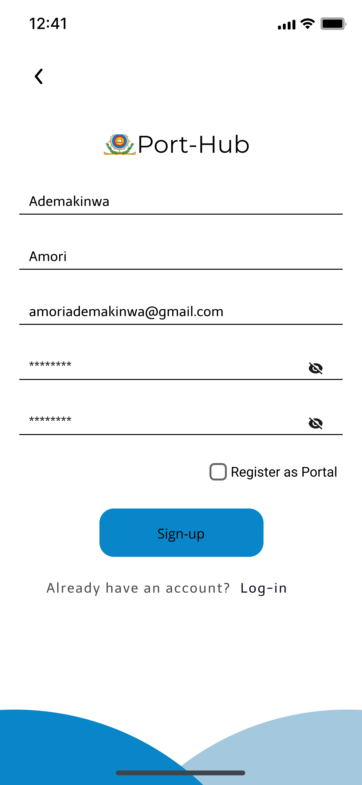
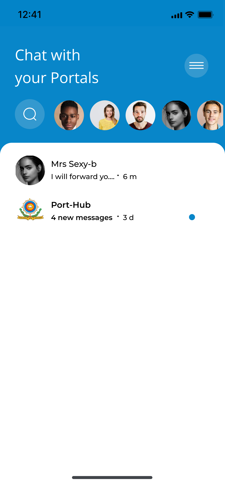
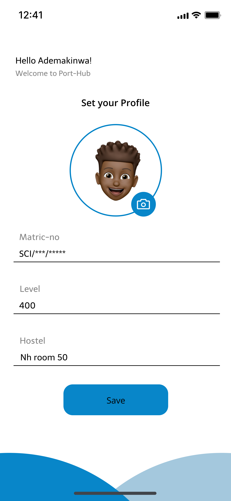

# Port-Hub

A messaging and contact chat application application built with Flutter.

## Inspiration

Link to Design on [Figma](https://www.figma.com/file/alRtPjVqpQNgMqt1uoLp2d/porthub?node-id=417%3A804)

## Screenshots

| Splash Screen | Get Started Screen | 
|    :---:     |     :---:      |  
|    |    |

| Log In Screen | Sign Up Screen | 
|    :---:     |     :---:      |  
|    |    |

| Home Screen | Chat Screen | 
|    :---:     |     :---:      |  
|    |    |

| Drawer Screen | Favourites Screen | 
|    :---:     |     :---:      |  
|    |    |

| Profile Screen | 
|    :---:     |    
|  | 

## Contributions

Feel free to contribute to this project.

If you find a bug or want a feature, but don't know how to fix/implement it, please fill an [issue](https://github.com/levi956/port-hub/issues).
If you fixed a bug or implemented a feature, please send a [pull request](https://github.com/levi956/port-hub/pulls).
